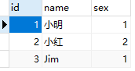

## 基本模式

1. 独立数据库（database）

每个租户有不同数据库，数据隔离级别最高，但成本也高

2. 共享数据库，隔离数据架构（scheme、表）

多个或所有租户共享同一个数据库，但每个租户有不同的数据表

3. 共享数据表和数据结构

共用同一张表，通过 tenantID 区分租户的数据。这种方案成本最低，共享程度最高，隔离级别最低。

### 之前的表



| **User_id** | **User_name** |
| ----------- | ------------- |
| 101         | Shenyi        |
| 102         | Lisi          |
| 103         | zhangsan      |

### 表的拆分

租户表

| **tenant_****id** | **tenant_****name** |
| ----------------- | ------------------- |
| 1                 | 租户1               |
| 2                 | 租户2               |
| 2                 | 租户3               |

用户表

| **User_id** | **User_name** | **Tenant_****id** |
| ----------- | ------------- | ----------------- |
| 101         | Shenyi        | 1                 |
| 102         | Lisi          | 2                 |
| 103         | zhangsan      | 3                 |


## 配置文件

```bash
[request_definition]
r = sub, dom, obj, act

[policy_definition]
p = sub, dom, obj, act

[role_definition]
g = _, _, _

[policy_effect]
e = some(where (p.eft == allow))

[matchers]
m = g(r.sub, p.sub, r.dom) && r.dom == p.dom && r.obj == p.obj && r.act == p.act
```

多了一个 dom 域的表示

|      |        |         |         |      |
| ---- | ------ | ------- | ------- | ---- |
| p    | admin  | domain1 | /depts  | GET  |
| p    | admin  | domain2 | /depts  | POST |
| g    | shenyi | admin   | domain1 |      |
| g    | lisi   | admin   | domain2 |      |

```go
package main

import (
	"github.com/casbin/casbin/v2"
	"log"
)

func main() {
	sub:= "lisi" // 想要访问资源的用户。
	obj:= "/depts" // 将被访问的资源。
	act:= "POST" // 用户对资源执行的操作。
	e,_:= casbin.NewEnforcer("resources/model_t.conf","resources/p_t.csv")

	ok,err:= e.Enforce(sub,"domain2", obj, act)
	if err==nil && ok {
		log.Println("运行通过")
	}
}
```


